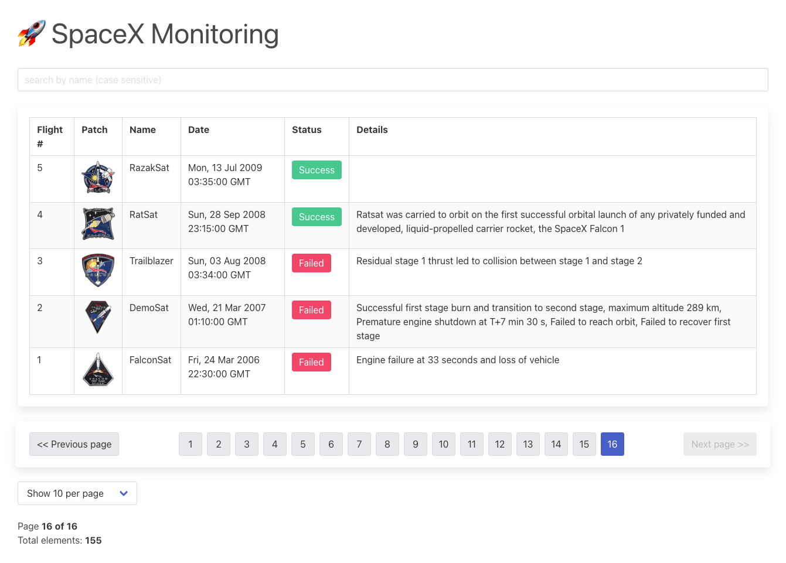

#Notes

Considering the strict time limit for the task I decided to start with the popular boilerplate, without TypeScript, though I use it in everyday job, just thought I'd rather not spend any time finding the proper type for anything, and plus I kind of forgot about how it is to work with plain JS. I somewhat regret about this decision now.

I also wanted to try the React Query library for this task, though I haven't used it before. It might look like an overhead here, but I liked the experience and certainly will try to learn the library deeper.

At the very beginning I decided to make a table with pagination, because an ordinary call for all launches is quite heavy.

I added a Bulma CSS library just to make the page look a little more friendly. Working on the task I had a thought that maybe a library like MUI would be a better choice, having in mind the big amount of data from SpaceX API and possibility to expand the app.

In the end I spent definitely less than 8 hours, and I was managed to do a simple page with table with pagination, getting info from API with queries and an input to search by launch name.

Looking forward to your feedback.
